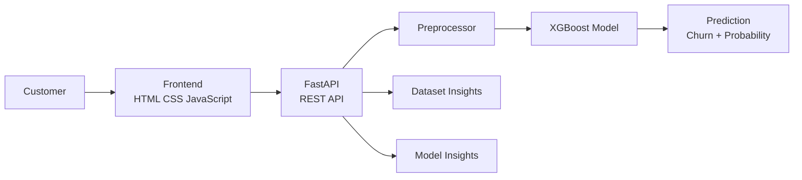

<div align="center">


# Dropline

### Telecom Customer Churn Prediction

An end-to-end machine learning application for predicting customer churn and analyzing the factors behind it.

<p>
  <a href="https://dropline-1.onrender.com">
    
  </a>
  <a href="https://github.com/Sufiyan485/dropline">
    
  </a>
</p>

<p>
  
  
  
  
  
  
</p>

</div>

---

## 🚀 What I Built

**Dropline** is a deployed telecom customer churn prediction system that combines a **tuned XGBoost model**, **FastAPI backend**, and an **AI-assisted interactive frontend**.

The application has three main sections:

- 🎯 **Customer Prediction** — enter customer details and get a churn prediction and probability.
- 📊 **Customer Insights** — explore churn patterns across contract, tenure, monthly charges, internet service, and payment method.
- 🧠 **Model Insights** — view model performance, confusion matrix, and feature importance.

Additional features include:

- 🔄 What-if customer re-scoring
- ✅ Customer-input validation
- 📈 Interactive dataset insights
- 🧠 Model feature importance
- ⚡ Automatic handling of Render backend cold starts

> **Frontend note:** The UI was developed with AI assistance and integrated and tested with the FastAPI backend.

---

## 🏗️ Architecture



### ML Workflow

```text
Dataset
   ↓
Data Cleaning
   ↓
EDA
   ↓
Preprocessing Pipeline
   ↓
Model Training
   ↓
Hyperparameter Tuning
   ↓
XGBoost
   ↓
FastAPI
   ↓
Frontend
   ↓
Deployment
```

---

## 📊 Model Results

The final tuned XGBoost model was evaluated on **1,409 held-out customers**.

| Metric | Result |
|---|---:|
| Accuracy | **74.10%** |
| Precision | **51%** |
| Recall | **81%** |
| F1 Score | **62%** |
| ROC-AUC | **84.63%** |

### Confusion Matrix

```text
                  Predicted
                 No       Yes
Actual No       741      294
       Yes       71      303
```

The model was tuned with a focus on **recall**, because identifying customers who are actually likely to churn is important for a retention-focused use case.

---

## 🔎 Key Dataset Insights

Some important patterns found in the dataset:

| Segment | Churn Rate |
|---|---:|
| Month-to-month contract | **42.71%** |
| One-year contract | **11.27%** |
| Two-year contract | **2.83%** |
| 0–12 months tenure | **47.44%** |
| 61–72 months tenure | **6.61%** |
| Fiber optic | **41.89%** |
| Electronic check | **45.29%** |
| Overall churn | **26.54%** |

These insights are calculated from the dataset and displayed in the **Customer Insights** section of the application.

---

## 🧠 Key Technical Decisions

### Why XGBoost?

Several classification models were explored, including:

- Logistic Regression
- Decision Tree
- Random Forest
- XGBoost

XGBoost provided strong ROC-AUC performance and was selected as the final model after hyperparameter tuning.

### Why a preprocessing pipeline?

Numerical and categorical preprocessing was combined using `Pipeline` and `ColumnTransformer`.

This ensures that the same preprocessing steps used during training are consistently applied when making predictions.

### Why recall matters?

The churn class is the minority class.

A high recall helps reduce the number of customers who are actually going to churn but are missed by the model.

### Why FastAPI?

FastAPI provides a REST API layer between the trained ML model and the frontend, allowing the model to be used as a real application rather than only from a notebook.

---

## 🛠️ Tech Stack

<p align="center">
  
</p>

| Category | Technologies |
|---|---|
| **Language** | Python 3.12.5 |
| **ML / Data** | Pandas, NumPy, Scikit-learn, XGBoost |
| **Model Persistence** | Joblib |
| **Backend** | FastAPI, Pydantic, Uvicorn |
| **Frontend** | HTML, CSS, JavaScript |
| **Deployment** | Render |
| **Version Control** | Git, GitHub |

---

## 📁 Project Structure

```text
dropline/
│
├── backend/
│   ├── main.py
│   ├── preprocessor.pkl
│   ├── xgb_model.json
│   ├── requirements.txt
│   └── telecom_churn_cleaned.csv
│
├── data/
│   └── telecom_churn.csv
│
├── frontend/
│   ├── logo.svg
│   ├── index.html
│   ├── api.js
│   ├── script.js
│   └── style.css
│
├── notebooks/
│   └── customer_churn.ipynb
│
├── .gitignore
└── README.md
```

---

## ⚙️ Run Locally

### 1. Clone the repository

```bash
git clone https://github.com/Sufiyan485/dropline.git
cd dropline
```

### 2. Create a virtual environment

```bash
python -m venv .venv
```

Activate it on Windows:

```bash
.venv\Scripts\activate
```

### 3. Install dependencies

```bash
pip install -r backend/requirements.txt
```

### 4. Start the FastAPI backend

From the project root:

```bash
uvicorn backend.main:app --reload
```

The API will run at:

```text
http://127.0.0.1:8000
```

### 5. Run the frontend

Serve the `frontend` folder using a local development server such as VS Code Live Server.

The frontend automatically uses the local FastAPI backend during development and the deployed backend when accessed from the deployed application.

---

## 🌐 Deployment

### Live Demo

**https://dropline-1.onrender.com**

### FastAPI Backend

**https://dropline-kq9g.onrender.com**

The frontend and backend are deployed separately and communicate through REST API calls.

The deployed frontend also handles the Render free-tier cold start by waiting for the backend to become available without requiring a manual page refresh.

---

## 🔮 Future Improvements

- [ ] Add a database for customer records and prediction history
- [ ] Store prediction results and timestamps
- [ ] Add customer prediction history
- [ ] Add SHAP-based model explanations
- [ ] Experiment with threshold optimization and probability calibration
- [ ] Add GenAI-powered churn explanations
- [ ] Add personalized customer-retention recommendations
- [ ] Add authentication
- [ ] Add model monitoring


---

## 🎯 Project Goal

Dropline was built to practice the complete journey from:

**Machine Learning Model → Backend API → Frontend Application → Deployment**

The project demonstrates how a trained machine learning model can be transformed from a notebook experiment into a usable end-to-end web application.

---

<div align="center">

### ⭐ If you found Dropline interesting, consider giving the repository a star!

**Built with Python • XGBoost • FastAPI • JavaScript**

</div>